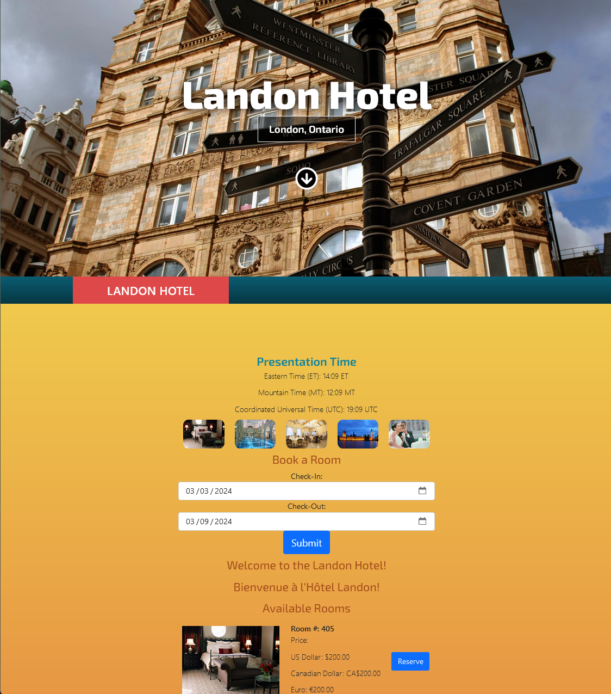

# Hotel Reservation Manager

The Hotel Reservation Manager is a specialized application created for the Landon Hotel in Toronto, Canada, facilitating hotel reservation management. It employs a Spring Boot Java backend, an Angular frontend, and is tailored for English and French users, incorporating features like currency display and time zone conversion to cater to a diverse clientele.

## Table of Contents

- [Languages Used](#languages-used)
- [Technologies Used](#technologies-used)
- [Setup and Running the Application](#setup-and-running-the-application)
- [Features](#features)
- [Docker Deployment](#docker-deployment)
- [License](#license)

## Languages Used

- Java

## Technologies Used

- Spring Boot
- Angular
- Maven
- Docker
- Localization and Internationalization with Java Resource Bundles
- Currency Conversion (Frontend Logic)
- Time Zone Conversion (Java Backend Logic)

## Setup and Running the Application

Ensure Java, Maven, Node.js, and Angular CLI are installed.

### Frontend Setup

1. Move to the `UI` folder.
2. Execute `npm install` to install Angular dependencies.
3. Run `ng build` and `ng serve` to start the Angular frontend, accessible at `localhost:4200`.

### Backend Setup

1. Execute `mvn clean install` and `mvn spring-boot:run` to initiate the Spring Boot backend.
2. Application available at `localhost:8080`.

## Features

### Localization and Internationalization

- Java Resource Bundles for English and French welcome messages, displaying them concurrently via multithreading.

### Currency Display

- Angular frontend adapted to showcase reservation costs in USD, CAD, and EUR, independent of backend modifications.

### Time Zone Conversion

- Java class for time conversion between ET, MT, and UTC.
- REST controller makes the time conversion accessible to the frontend.

## Docker Deployment

1. Package the application using `mvn clean package`.
2. Establish a `Dockerfile` at the project root.
3. Build and deploy the Docker image, making it available on port `8080`.

## License

[MIT License](LICENSE)
